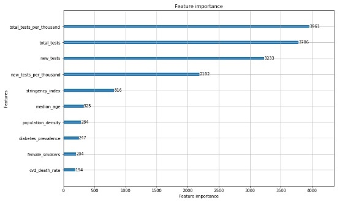

# Covid-19 project: Investigating the effect of different factors on the COVID-19 mortality rate #

## Description
The world has been encountered with a challenging and difficult situation since COVID-19 got to a pandemic situation. Not only COVID-19 have too high prevalence rate, but also its mortality rate is high, specifically between old people. Scientists declare many factors related to the mortality rate of this disease.In this project, the effect of these factors has been investigated to specify which factors are the most effective ones.

## Table of Contents
* [Dataset](#Dataset)
* [Analysis Prodecure](#Analysis-Procedure)  
* [Results](#Results)  
* [Usage](#Usage)  
* [Conclusion](#Conclusion)  

## Dataset

The used data is available at: [owid-covid-data.csv](https://ourworldindata.org/coronavirus)

### Data Structure

* **iso_code:** The International Organization for Standardization (ISO) created and maintains the ISO
3166 standard – Codes for the representation of names of countries and their subdivisions.  

* **location:** This variable represents full name of countries.

* **date:** The dataset is organized based on date. 

* **total_cases:** It is a cumulative variable, which shows total number of infected persons in a country.                                                                          
* **new_cases:** The quantity of new confirmed infected persons during a day.

* **total_deaths :** It is a cumulative variable, which shows total number of passed away persons in a country.

* **new_deaths:** New confirmed passed away persons during a day by Covid-19.

* **total_cases_per_million:** Total number of confirmed infected people per a million population.   

* **new_cases_per_million:** Number of new confirmed infected people per a million population. 

* **total_deaths_per_million:** Total number of confirmed expired people per a million population. 

* **new_deaths_per_million:** Number of new confirmed expired people per a million population.  

* **total_tests:** It shows how many tests have been done totally in a country.  

* **new_tests:** It displays how many new tests during a day are operated in a country.  

* **total_tests_per_thousand:** Total number of tests per thounands of population  

* **new_tests_per_thousand:**   Number of new tests per thousands of population 

* **tests_units:** This variable shows with which criteria each country counts its operated tests.   

* **stringency_index:** This index indicates if there is rigid governmental rules to control the Covid-19 prevalence or not.  

* **population:** It shows the population of countries. 

* **population_density:** It shows the number of people per unit of area in each country.  

* **median_age:** It shows what the median age of a country is.  

* **aged_65_older:** The rate of people older than 65.  

* **aged_70_older:** The rate of people older than 70.  

* **gdp_per_capita:** shows a country's GDP divided by its total population.  

* **extreme_poverty:** Which portion of a society lives in the severe poverty situation. 

* **cvd_death_rate:** This index shows the prevalence of heart disease(Cardiovascular disease) in each countries.  

* **diabetes_prevalence:** This index displays the prevalence of diabetes in each countries. 

* **female_smokers:** The rate of smoking between female persons in a country. 

* **male_smokers:** The rate of smoking between male persons in a country.  

* **handwashing_facilities:** Indicates if there is handwashing facilities in a country available or not.   

* **hospital_beds_per_100k:** Specifies how many beds are available per a hundred thousands of population. 

   

## Analysis Procedure

### preprocessing
1. Rows with missing data were eliminated
2. Rows with zero total cases were dropped
3. Defining dependant variable which is "total deaths/total cases"
4. Feature selection process:  
   The useless columns were deleted. The remained features for processing are : 
   'total_tests', 'new_tests', 'total_tests_per_thousand', 'new_tests_per_thousand', 'stringency_index', 'population',
   'population_density', 'median_age', 'aged_65_older', 'aged_70_older', 'gdp_per_capita', 'extreme_poverty', 'cvd_death_rate',
   'diabetes_prevalence', 'female_smokers', 'male_smokers', 'handwashing_facilities', 'hospital_beds_per_100k'
### algorithm and processing
The first important point to be mentioned is that all variables are numerical ones. The model used for processing is [LightGBM](https://github.com/microsoft/LightGBM). LightGBM is a gradient boosting framework that uses tree based learning algorithms. It is designed to be distributed and efficient with the following advantages:

    * 1: Faster training speed and higher efficiency.
    * 2: Lower memory usage.
    * 3: Better accuracy. 
    * 4: Support of parallel and GPU learning.
    * 5: Capable of handling large-scale data.

## Usage tips
The required packages to run the script are: matplotlib, lightgbm, pandas, sklearn, and ipywidgets  
  
  
  
**ipywidgets installation:**  
  Users can install and activate the current version of ipywidgets with pip or conda.  
  
    pip install ipywidgets
    jupyter nbextension enable --py widgetsnbextension
   

## Results

   

Concerning the outcome chart, The most important factor associated with mortality rate is 'total_tests_per_thousand'. Besides, The first four ones all are related to 'testing'. It shows the great importance of the 'testing' factor. Its effect on controlling the prevalence of COVID-19 was approved by epidemiologists, but it also can decrease the mortality rate of disease. Actually, when the prevalence rate starts to decrease, more facilities get available for infected people, so the mortality rate decreases as well. This result emphasizes the vital role of the testing in societies and its priority to other policies. The other features are connected with mortality rate are, 'stringency_index', 'median_age', 'population_density', 'diabetes_prevalence', 'female_smokers' and 'cvd_death_rate', respectively. 'stringency_index' and 'population_density' are important factors in controlling the epidemy, so they also reduce the mortality rate.
'median_age', 'diabetes_prevalence', 'female_smokers', and 'cvd_death_rate' are all known health problems that increase the vulnerability of infected people against the COVID-19.   
Other examined factors including 'population', 'gdp_per_capita', 'extreme_poverty', 'cvd_death_rate', 'hospital_beds_per_100k' do not have considerable effect on mortality rate of COVID-19.

